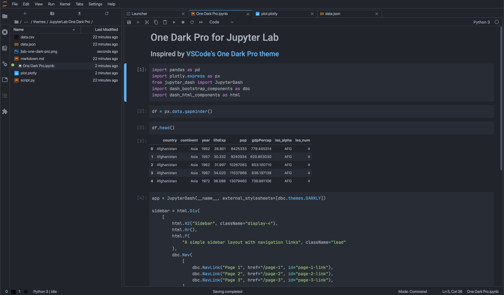
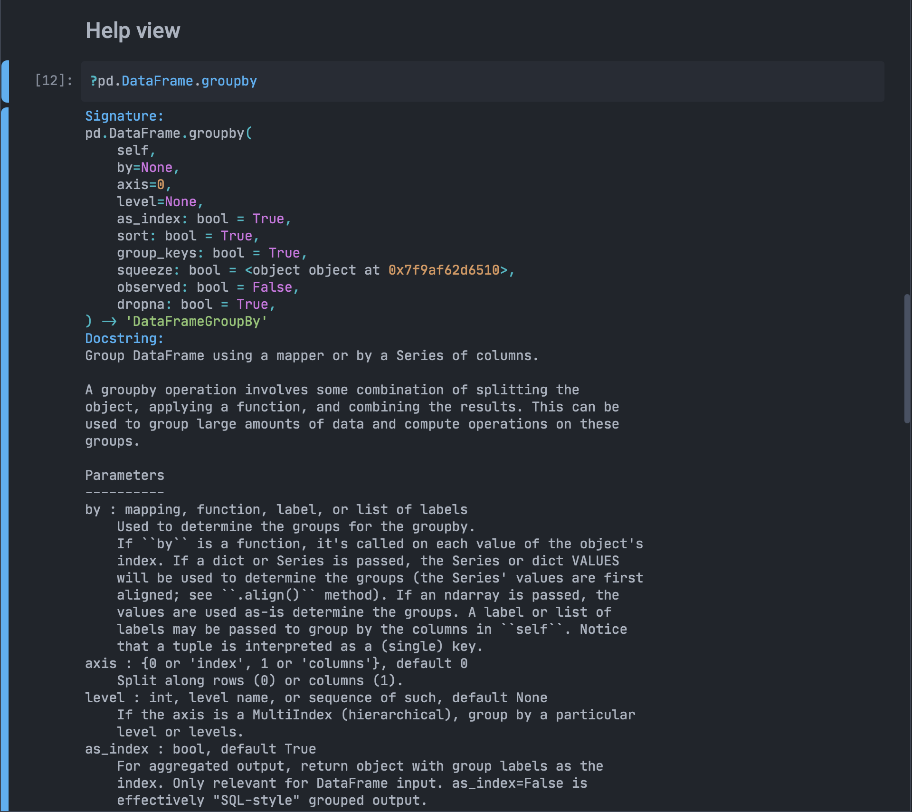
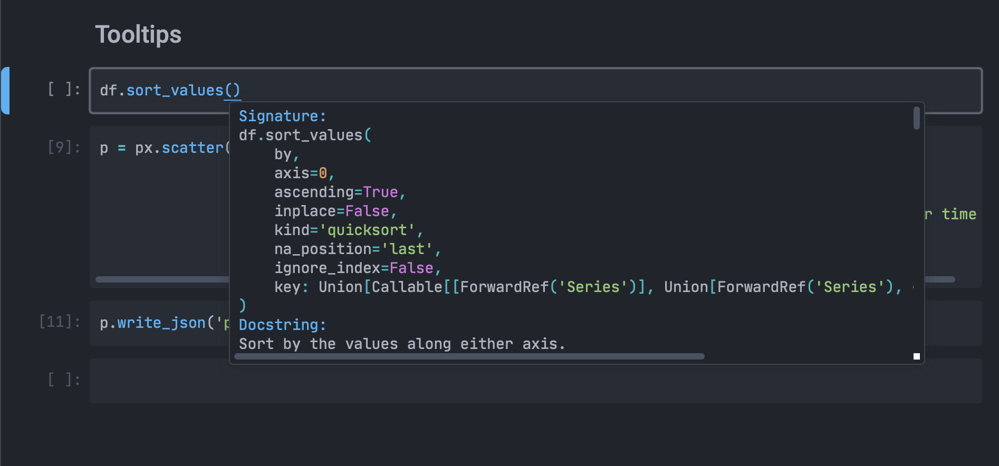
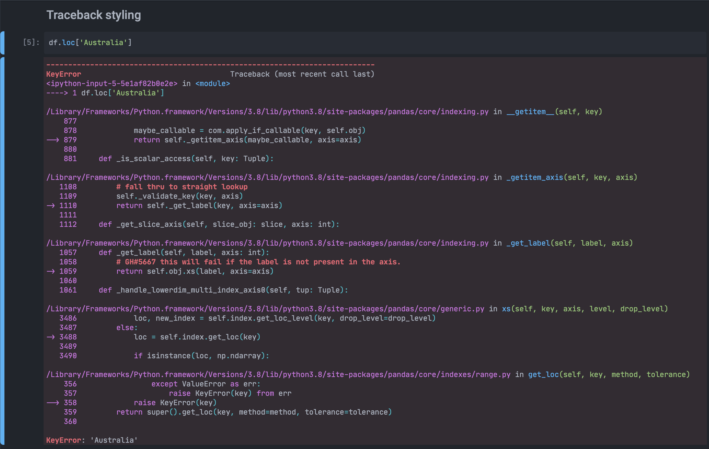
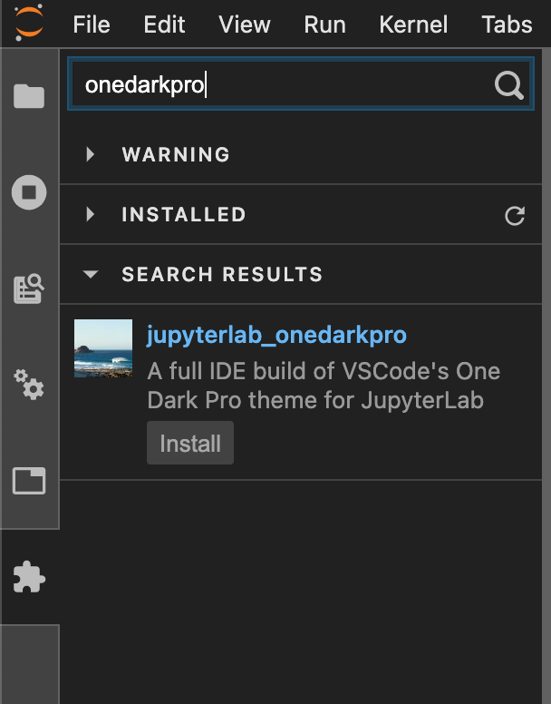

<span>
    
    <h1>One Dark Pro for JupyterLab</h1>
</span>

A full IDE build of [VSCode's One Dark Pro](https://marketplace.visualstudio.com/items?itemName=zhuangtongfa.Material-theme) theme for JupyterLab



## Beyond a simple syntax highlighter

Features modern IDE padding, borders, hover effects and rounded corners.

Extends to:

- **Help view:**



- **Tooltips:**



- **Tracebacks:**



- **and more**

## Prerequisites

- JupyterLab 4

## Installation

### Terminal

```bash
pip install jupyterlab_onedarkpro
```

or 

```bash
conda install jupyterlab_onedarkpro
```

### JupyterLab UI

1. Open JupyterLab
2. Click on Extensions tab in sidebar (puzzle piece)
3. Enable Extensions (if not done already)
4. Seach for `onedarkpro`
5. Click `Install` under `jupyterlab_onedarkpro`



## Development

Note: You will need NodeJS to build the extension package.

The `jlpm` command is JupyterLab's pinned version of
[yarn](https://yarnpkg.com/) that is installed with JupyterLab. You may use
`yarn` or `npm` in lieu of `jlpm` below.

```bash
# Clone the repo to your local environment
# Change directory to the jupyterlab_onedarkpro directory
# Install package in development mode
pip install -e .
# Link your development version of the extension with JupyterLab
jupyter labextension develop . --overwrite
# Rebuild extension Typescript source after making changes
jlpm run build
```

You can watch the source directory and run JupyterLab at the same time in different terminals to watch for changes in the extension's source and automatically rebuild the extension.

```bash
# Watch the source directory in one terminal, automatically rebuilding when needed
jlpm run watch
# Run JupyterLab in another terminal
jupyter lab
```

With the watch command running, every saved change will immediately be built locally and available in your running JupyterLab. Refresh JupyterLab to load the change in your browser (you may need to wait several seconds for the extension to be rebuilt).

By default, the `jlpm run build` command generates the source maps for this extension to make it easier to debug using the browser dev tools. To also generate source maps for the JupyterLab core extensions, you can run the following command:

```bash
jupyter lab build --minimize=False
```

### Uninstall

```bash
pip uninstall jupyterlab_onedarkpro
jupyter labextension uninstall jupyterlab_onedarkpro
```
